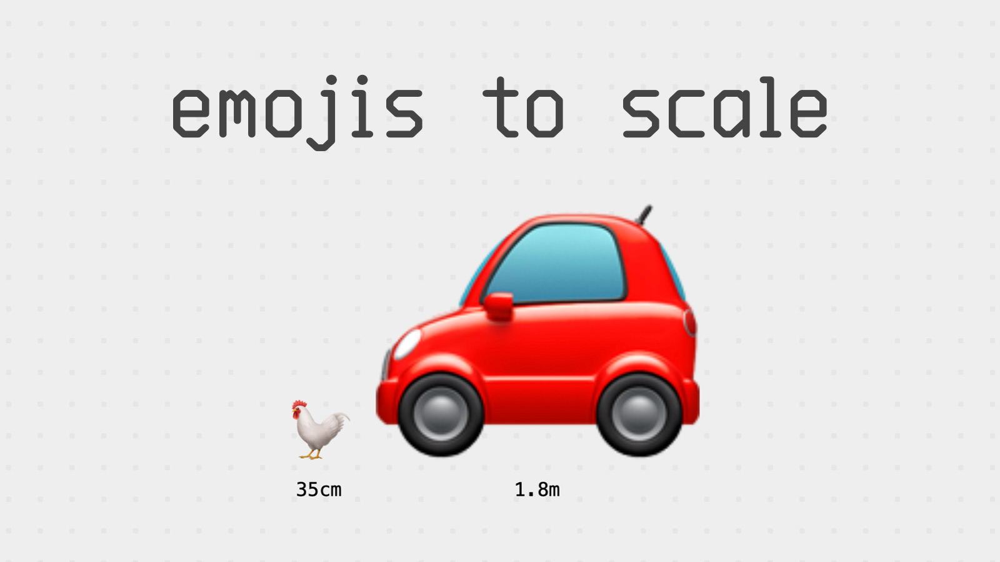

# [Emoji to Scale](http://javier.xyz/emoji-to-scale/)

Your favorite emojis. To scale (more or less). Inspired by [this joke](https://twitter.com/MarcBeddy/status/290598911851245568).

[](https://javier.xyz/emoji-to-scale/)

## How can I add more emojis or fix an emoji size?

The data source is a `.csv` file located at [https://github.com/javierbyte/emoji-to-scale/blob/master/src/emoji-data.csv](https://github.com/javierbyte/emoji-to-scale/blob/master/src/data), feel free to send a Pull Request!

## Running the project locally

```
npm install
npm start
```